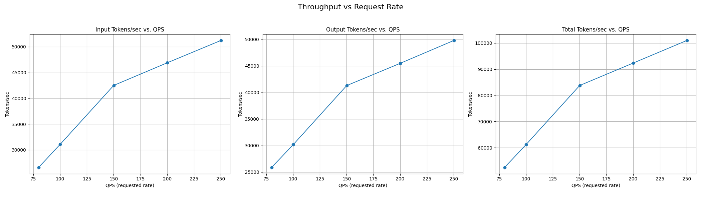
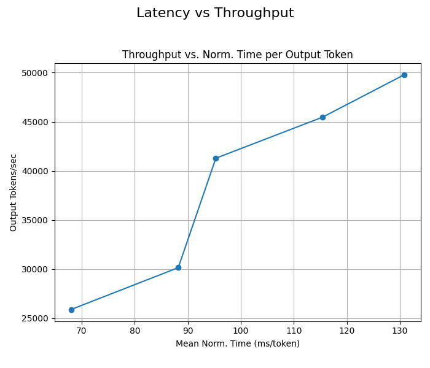

# Experimental: Data Parallel (DP) Aware WideEP Scheduling

This deployment uses **DP-aware scheduling**, where instead of letting vLLM automatically handle data parallelism internally, we explicitly launch separate vLLM server instances for each data parallel rank with a separate port for each rank. This enables the EPP to schedule requests directly to specific DP ranks, improving KV cache routing efficiency.

## Discussion

vLLM supports multiple "modes" for DP load balancing, including:
- **internal**, where vLLM manages DP-balancedness across all ranks. vLLM exposes a single API server endpoint and spreads load between ranks


- **external**, where an external router manages DP-balancedness. Each DP-rank exposes an API server endpoint and the external LB balances between these endpoints


vLLM also has a **hybrid** mode, where a single API server is exposed PER-NODE. An external LB balances BETWEEN nodes and vLLM balances WITHIN a node.

In the context of `llm-d`, we want to use **external** load-balancing, so that the `llm-d` EPP is able to properly schedule requests with prefix-cache awareness, which requires targeting a specific DP-rank rather than a particular node. However, WideEP leverages **DeepEP** for the sparse dispatch/combine operations needed for WideEP. DeepEP uses `cuda_ipc` for intra-node traffic, which cannot cross pod-boundaries so using **one-pod-per-dp-rank** is not an option for WideEP deployments - we need to use **one-pod-per-node**. As a result, we have primarily been using vLLM's **hybrid** DP-load balancing mode - meaning `llm-d`'s EPP is unable to schedule onto specific ranks (only can schedule at the node level), meaning that prefix-cache aware routing features from EPP have been incompatible with WideEP deployments.

### Multi-Port Solution

To overcome this challenge, we instead launch 8 vLLM DP instances (each with a separate API endpoint) within a pod that has 8 visible GPUs (all the GPUs on a node). As a result, **DeepEP** is able to communicate over `cuda_ipc` within the node. Then, we configure the Gateway and InferencePool with **multi-port** support. The Gateway and EPP view each vLLM pod as a collection of 8 separate API endpoints and schedules onto each one of these endpoints directly.

We can, therefore, compose the WideEP deployment with the existing scorers (for example, `prefix-cache-scorer` and `active-request-scorer`) to balance load across the ranks and handle complex multi-turn request patterns.

### Why This is Experimental

We are currently working on hardenening the process management, health checking, and probes in vLLM to handle better this style of deployment. Once this is complete, we will upgrade this guide to the default.

## Overview

This guide demonstrates how to deploy DeepSeek-R1-0528 using vLLM's P/D disaggregation support with NIXL in a wide expert parallel pattern with LeaderWorkerSets with DP-aware scheduling. This guide has been validated on:

* a 32xH200 cluster with InfiniBand networking
* a 32xB200 cluster with InfiniBand networking
* Istio 1.28.1 (required for multi-port support)

In this example, we will demonstrate a deployment of `DeepSeek-R1-0528` with:

* 2 DP=8 Prefill Worker
* 1 DP=16 Decode Worker

## Hardware Requirements

This guide requires 32 Nvidia H200 or B200 GPUs and InfiniBand or RoCE RDMA networking. Check `modelserver/base/decode.yaml` and `modelserver/base/prefill.yaml` for detailed resource requirements.

## Prerequisites

* Have the [proper client tools installed on your local system](../prereq/client-setup/README.md) to use this guide.
* Ensure your cluster infrastructure is sufficient to [deploy high scale inference](../prereq/infrastructure/README.md)
  * You must have high speed inter-accelerator networking
  * The pods leveraging inter-node EP must be deployed in a cluster environment with full mesh network connectivity.
    * **_NOTE:_** The DeepEP backend used in WideEP requires All-to-All RDMA connectivity. Every NIC on a host must be able to communicate with every NIC on all other hosts. Networks restricted to communicating only between matching NIC IDs (rail-only connectivity) will fail.
  * You have deployed the [LeaderWorkerSet optional controller](../prereq/infrastructure/README.md#optional-install-leaderworkerset-for-multi-host-inference)
* Configure and deploy your [Gateway control plane](../prereq/gateway-provider/README.md). Note that the Gateway must support multi-port (e.g. Istio 1.28.1)
* Have the [Monitoring stack](../../docs/monitoring/README.md) installed on your system.
* Create a namespace for installation.

  ```bash
  export NAMESPACE=llm-d-wide-ep # or any other namespace (shorter names recommended)
  kubectl create namespace ${NAMESPACE}
  ```

* [Create the `llm-d-hf-token` secret in your target namespace with the key `HF_TOKEN` matching a valid HuggingFace token](../prereq/client-setup/README.md#huggingface-token) to pull models.
* [Choose an llm-d version](../prereq/client-setup/README.md#llm-d-version)

## Installation

```bash
cd guides/wide-ep-lws/
```

### Deploy Model Servers

CoreWeave are tested Kubernetes providers for this well-lit path. You can customize the manifests if you run on other Kubernetes providers.

<!-- TABS:START -->


<!-- TAB:CoreWeave -->
#### CoreWeave

```bash
kubectl apply -k ./manifests/modelserver/coreweave  -n ${NAMESPACE}
```

### Deploy InferencePool

Select the provider-specific Helm command using the tabs below.

#### Istio

```bash
helm install llm-d-infpool \
  -n ${NAMESPACE} \
  -f ./manifests/inferencepool.values.yaml \
  --set "provider.name=istio" \
  oci://registry.k8s.io/gateway-api-inference-extension/charts/inferencepool \
  --version v1.3.0
```

### Deploy Gateway and HTTPRoute

Deploy the Gateway and HTTPRoute using the [gateway recipe](../recipes/gateway/README.md).

### Gateway options

To see what gateway options are supported refer to our [gateway provider prereq doc](../prereq/gateway-provider/README.md#supported-providers). Gateway configurations per provider are tracked in the [gateway-configurations directory](../prereq/gateway-provider/common-configurations/).

You can also customize your gateway, for more information on how to do that see our [gateway customization docs](../../docs/customizing-your-gateway.md).

## Verifying the installation

* Firstly, you should be able to list all helm releases installed into your chosen namespace:

```bash
helm list -n ${NAMESPACE}
NAME            NAMESPACE       REVISION    UPDATED                                 STATUS      CHART                       APP VERSION
llm-d-infpool   llm-d-wide-ep   1           2025-08-24 13:14:53.355639 -0700 PDT    deployed    inferencepool-v1.3.0        v0.3.0
```

* Out of the box with this example you should have the following resources (if using Istio):

```bash
kubectl get all -n ${NAMESPACE}
NAME                                                         READY   STATUS    RESTARTS   AGE
pod/infra-wide-ep-inference-gateway-istio-74d5c66c86-h5mfn   1/1     Running   0          2m22s
pod/wide-ep-llm-d-decode-0                                   2/2     Running   0          2m13s
pod/wide-ep-llm-d-decode-0-1                                 2/2     Running   0          2m13s
pod/llm-d-infpool-epp-84dd98f75b-r6lvh                       1/1     Running   0          2m14s
pod/wide-ep-llm-d-prefill-0                                  1/1     Running   0          2m13s
pod/wide-ep-llm-d-prefill-0-1                                1/1     Running   0          2m13s


NAME                                            TYPE           CLUSTER-IP    EXTERNAL-IP   PORT(S)                        AGE
service/infra-wide-ep-inference-gateway-istio   ClusterIP      10.16.1.34    10.16.4.2     15021:30312/TCP,80:33662/TCP   2m22s
service/wide-ep-ip-1e480070                     ClusterIP      None          <none>        54321/TCP                      2d4h
service/wide-ep-llm-d-decode                    ClusterIP      None          <none>        <none>                         2m13s
service/llm-d-infpool-epp                       ClusterIP      10.16.1.137   <none>        9002/TCP                       2d4h
service/wide-ep-llm-d-prefill                   ClusterIP      None          <none>        <none>                         2m13s

NAME                                                    READY   UP-TO-DATE   AVAILABLE   AGE
deployment.apps/infra-wide-ep-inference-gateway-istio   1/1     1            1           2m22s
deployment.apps/llm-d-infpool-epp                       1/1     1            1           2m14s

NAME                                                               DESIRED   CURRENT   READY   AGE
replicaset.apps/infra-wide-ep-inference-gateway-istio-74d5c66c86   1         1         1       2m22s
replicaset.apps/llm-d-infpool-epp-55bb9857cf                       1         1         1       2m14s

NAME                                                      READY   AGE
statefulset.apps/wide-ep-llm-d-decode     1/1     2m13s
statefulset.apps/wide-ep-llm-d-decode-0   1/1     2m13s
statefulset.apps/wide-ep-llm-d-prefill    1/1     2m13s
statefulset.apps/wide-ep-llm-d-prefill-1  1/1     2m13s
```

**_NOTE:_** This assumes no other guide deployments in your given `${NAMESPACE}` and you have not changed the default release names via the `${RELEASE_NAME}` environment variable.

## Using the stack

For instructions on getting started making inference requests see [our docs](../../docs/getting-started-inferencing.md)

**_NOTE:_** This example particularly benefits from utilizing stern as described in the [getting-started-inferencing docs](../../docs/getting-started-inferencing.md#following-logs-for-requests), because while we only have 3 inferencing pods, it has 16 vllm servers or ranks.

**_NOTE:_** Compared to the other examples, this one takes anywhere between 7-10 minutes for the vllm API servers to startup so this might take longer before you can interact with this example.

## Benchmarking

This is a simple benchmarking setup to demonstrate the correctness of the implementation.

### Overview

We deployed the default wide-ep-lws user guide on GKE (`./manifests/modelserver/gke-a4`).

* Provider: GKE
* Prefill: 1 instance with EP=16
* Decode: 1 instance with EP=16
* 4 `a4-highgpu-8g` VMs, 32 GPUs

We use the [inference-perf](https://github.com/kubernetes-sigs/inference-perf/tree/main) benchmark tool to generate random datasets with 1K input length and 1K output length. This benchmark targets batch use case and we aim to find the maximum throughput by sweeping from lower to higher request rates up to 250 QPS.

### Run Benchmark

1. Deploy the wide-ep-lws stack following the Installation steps above. Once the stack is ready, obtain the gateway IP: 

```bash
export GATEWAY_IP=$(kubectl get gateway/llm-d-inference-gateway -n ${NAMESPACE} -o jsonpath='{.status.addresses[0].value}')
```

2. Follow the [benchmark guide](../../guides/benchmark/README.md) to deploy the benchmark tool and analyze the benchmark results. Notably, select the corresponding benchmark template:

```
export BENCHMARK_TEMPLATE="${BENCH_TEMPLATE_DIR}"/wide_ep_template.yaml
```

### Results




At request rate 250, we achieved the max throughput:

```
"throughput": {
    "input_tokens_per_sec": 51218.79261732335,
    "output_tokens_per_sec": 49783.58426326592,
    "total_tokens_per_sec": 101002.37688058926,
    "requests_per_sec": 50.02468992880545
}
```

This equals to 3200 input tokens/s/GPU and 3100 output tokens/s/GPU.

## Cleanup

To remove the deployment:

```bash
# From examples/wide-ep-lws
helm uninstall llm-d-infpool -n ${NAMESPACE}
kubectl delete -k ./manifests/modelserver/<gke|coreweave> -n ${NAMESPACE}
kubectl delete -k ../recipes/gateway/<gke-l7-regional-external-managed|istio|kgateway|kgateway-openshift> -n ${NAMESPACE}
```

## Customization

For information on customizing a guide and tips to build your own, see [our docs](../../docs/customizing-a-guide.md)
